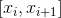
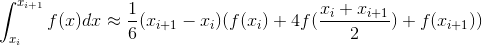
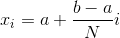
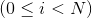
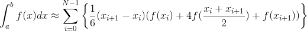
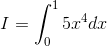
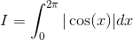
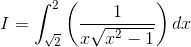

# gointegral --- golang implementation of Simpson method

シンプソン法の golang 実装。

十分小さな区間 
<!--

-->

  における関数 
<!--
)
-->

 の定積分は、次の近似式で与えられる。

<!--
dx\approx\frac{1}{6}(x_{i&plus;1}-x_i)(f(x_i)&plus;4f(\frac{x_i&plus;x_{i&plus;1}}{2})&plus;f(x_{i&plus;1})))
-->


区間 
<!--

-->

 の定積分であれば、区間を N 等分した十分に小さな区間 
<!--

-->

 の定積分の合計と考えればよい。

<!--

-->

 where 
<!--
)
-->


<!--

-->


----

gointegral では積分区間 interval、区間を等分する個数 N、積分対象とする関数 f を JavaScript のコードで与える。

例として、sin 関数の[0,π] 区間での定積分では次のような JavaScript コードを使う。

```javascript
// sin.js

// 積分区間 [a, b]
var interval = [0, Math.PI];

// 区間等分数 N
var n = 1000;

// 積分の対象とする関数 f(x)
function f(x) {
    return Math.sin(x);
}
```

gointegral の使い方は次の通りである。 

```
$ ./gointegral sin.js
interval = [0 3.141592653589793]
n = 1000
result = 1.999995065201925
$ 
```

積分結果がわかっていて、シンプソン法のエラー率[%]を求めたい場合には、次のように answer 変数を指定する。

```javascript
// 積分区間 [a, b]
var interval = [0, Math.PI];

// 区間等分数 N
var n = 1000;

// 積分の対象とする関数 f(x)
function f(x) {
    return Math.sin(x);
}

// エラー率[%]を算出するための正しい積分結果の指定 
var answer = 2;
```

実行結果は以下のとおりである。

```
$ ./gointegral sin.js
interval = [0 3.141592653589793]
n = 1000
result = 1.999995065201925
answer = 2
error  = 0.0002467399037531237 [%]
```

----
いくつか実行例を示す。

<!--

-->


```javascript
// 積分区間
var interval = [0, 1];

// 区間等分数 N
var n = 1000;

// 積分対象の関数
function f(x) {
    return 5*Math.pow(x, 4);
}

// エラー率を算出するための正しい積分結果の指定 
var answer = 1;
```

実行結果：

```
interval = [0 1]
n = 1000
result = 1.0000000000000449
answer = 1
error  = 4.4853010194856324e-12 [%]
```

----

<!--

-->


```javascript
// 積分区間
var interval = [0, 2*Math.PI];

// 区間等分数
var n = 1000;

// 積分対象の関数
function f(x) {
    return Math.abs(Math.cos(x));
}

// エラー率を算出するための正しい積分結果の指定 
var answer = 4;
```

実行結果：

```
interval = [0 6.283185307179586]
n = 1000
result = 4.006283143967614
answer = 4
error  = 0.15707859919034117 [%]
```

----

<!--
dx)
-->


```javascript
// 積分区間
var interval = [Math.sqrt(2), 2];

// 区間等分数
var n = 1000;

// 積分対象の関数
function f(x) {
    return 1/(x*Math.sqrt(Math.pow(x, 2)-1));
}

// エラー率を算出するための正しい積分結果の指定 
var answer = Math.PI/12;
```

実行結果：

```
interval = [1.4142135623730951 2]
n = 1000
result = 0.26196843201518166
answer = 0.2617993877991494
error  = 0.06457013419830616 [%]
```

